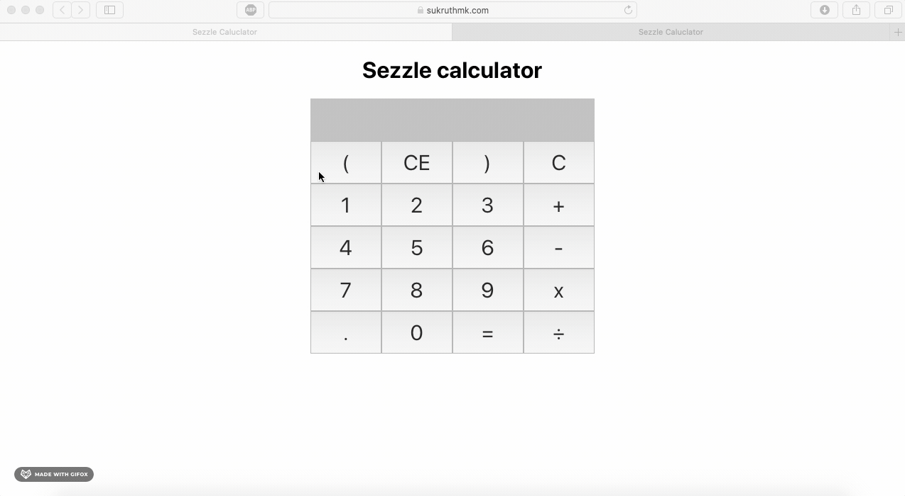

# Sezzle-Calc

A simple calculator app which logs calculations and shares with users connected to website.

Live app: [Sezzle Calculator](https://sukruthmk.com/Sezzle-Calc/)



## Running server

Goto server directory and install node modules using `npm i`

Then run the server using this command

```shell
npm start
```

This will run socket.io connection at port 4001

## Running frontend

### Install packages

```shell
npm i
```

### Start frontend app

```shell
yarn start
```

Runs the app in the development mode.
Open [http://localhost:3000](http://localhost:3000) to view it in the browser.

## Config changes

There are two endpoints in config.js  
SOCKET_ENDPOINT_DEV  
SOCKET_ENDPOINT_PROD

By default this app runs with SOCKET_ENDPOINT_PROD which is a deployed heroku server. If you want to use local server then set the endpoint to SOCKET_ENDPOINT_DEV in CalculatorContext.js
